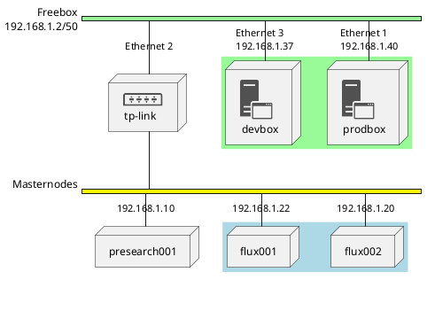

# Web3Invest Network Architecture

```plantuml
@startuml
!include <office/Servers/application_server>
!include <office/Servers/database_server>
!include <office/Devices/switch>

nwdiag {
  network Freebox {
    address = "192.168.1.2/50"
    color = "palegreen"
    switch [address = "Ethernet 2", shape = "node", description = "<$switch>\n tp-link"]
    group web {
      color = "palegreen"
      devbox [address = "Ethernet 3, 192.168.1.37", shape = "node",  description = "<$application_server>\n devbox"]
      prodbox [address = "Ethernet 1, 192.168.1.40", shape = "node", description = "<$application_server>\n prodbox"]
    }
  }

  network Masternodes {
    color = "yellow"
    switch
    presearch001 [address = "192.168.1.10", shape = "node"]
    group flux {
      color = "lightblue"
      flux001 [address = "192.168.1.22", shape = "node"]
      flux002 [address = "192.168.1.20", shape ="node"]
    }
  }
}
@enduml
```

